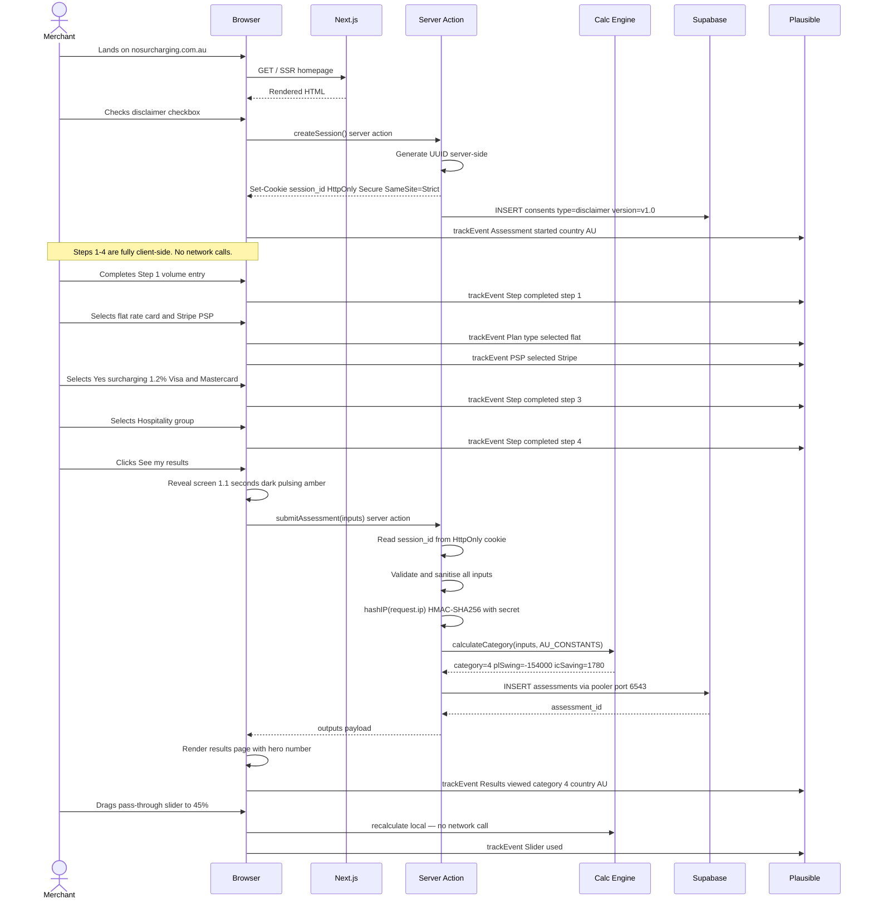
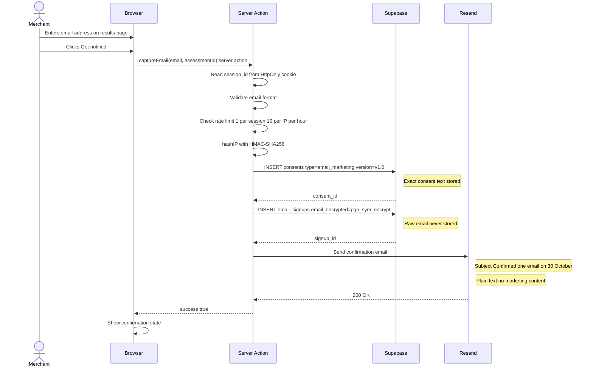
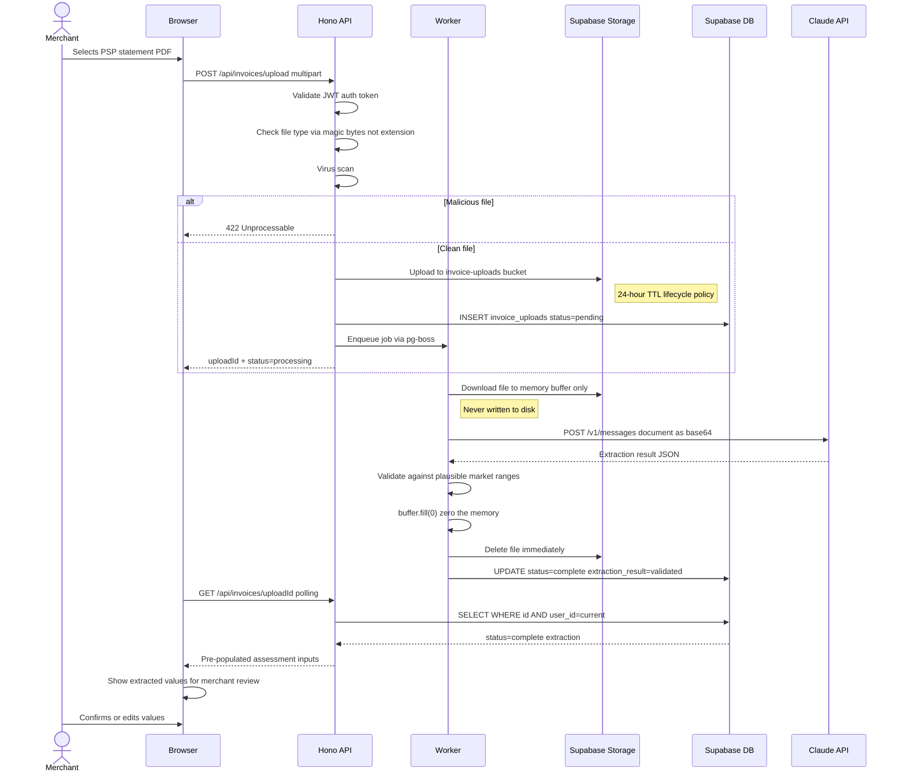
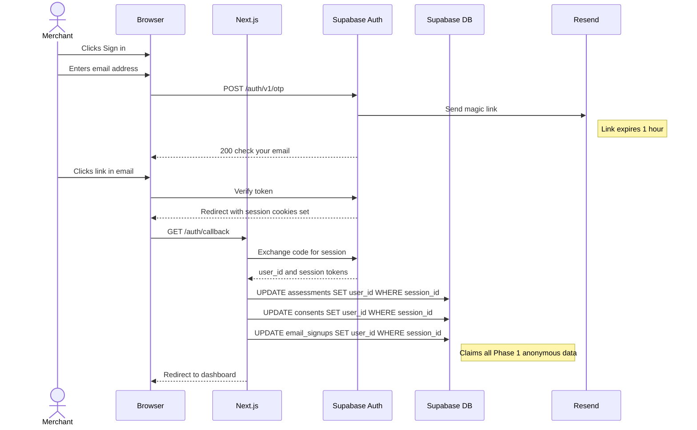
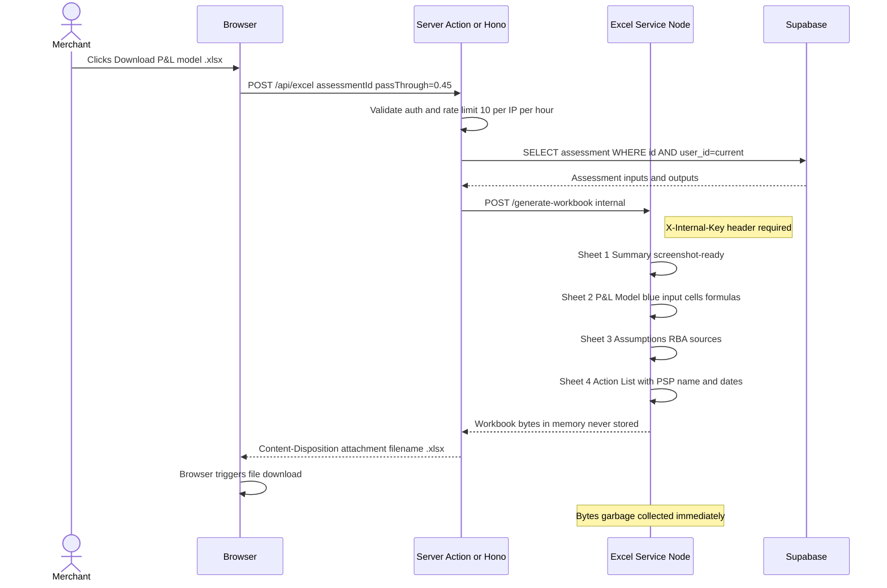
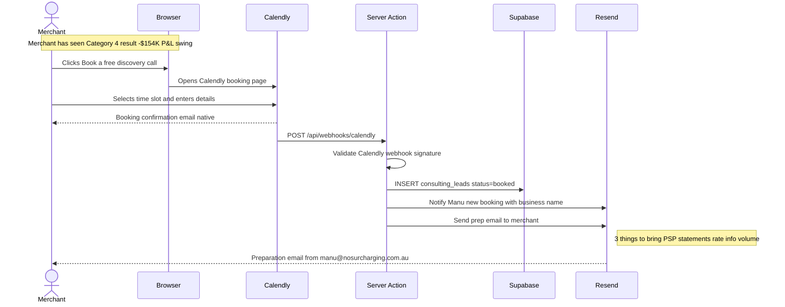

# Sequence Diagrams
## nosurcharging.com.au

All flows documented as Mermaid sequence diagrams. Render at mermaid.live or in any Mermaid-compatible viewer.

---

## Diagram 1 — Assessment submission flow (Phase 1)

---

## Diagram 2 — Email capture flow (Phase 1)

---

## Diagram 3 — Phase 2 invoice upload and parsing

---

## Diagram 4 — Phase 2 authentication (magic link)

---

## Diagram 5 — Phase 2 Excel download

---

## Diagram 6 — Consulting lead conversion

---

*Sequence Diagrams v1.0 · nosurcharging.com.au · April 2026*
