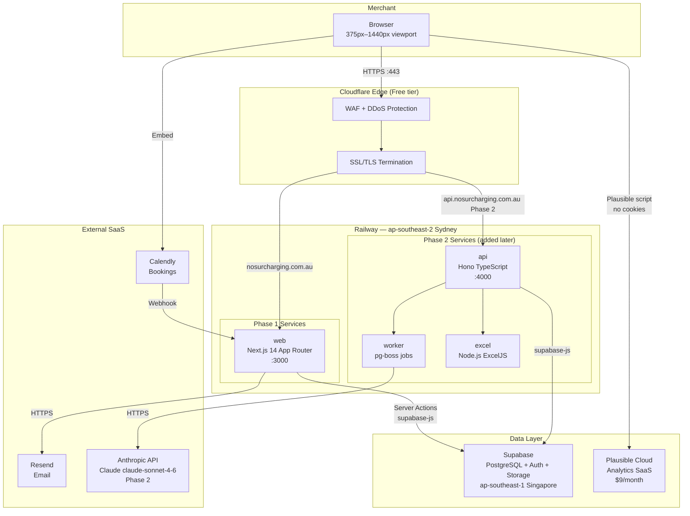
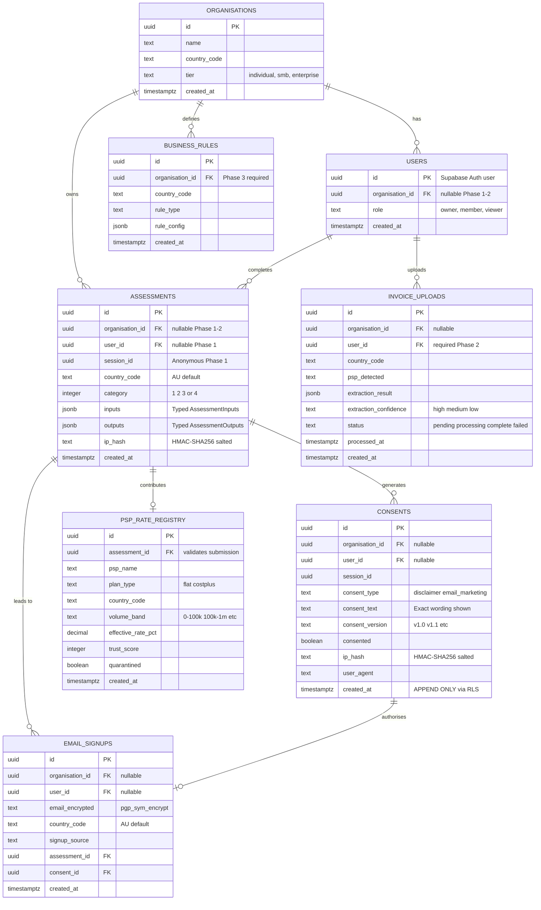
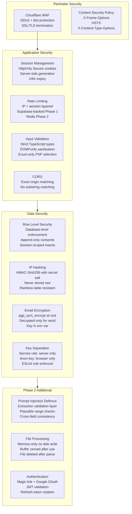
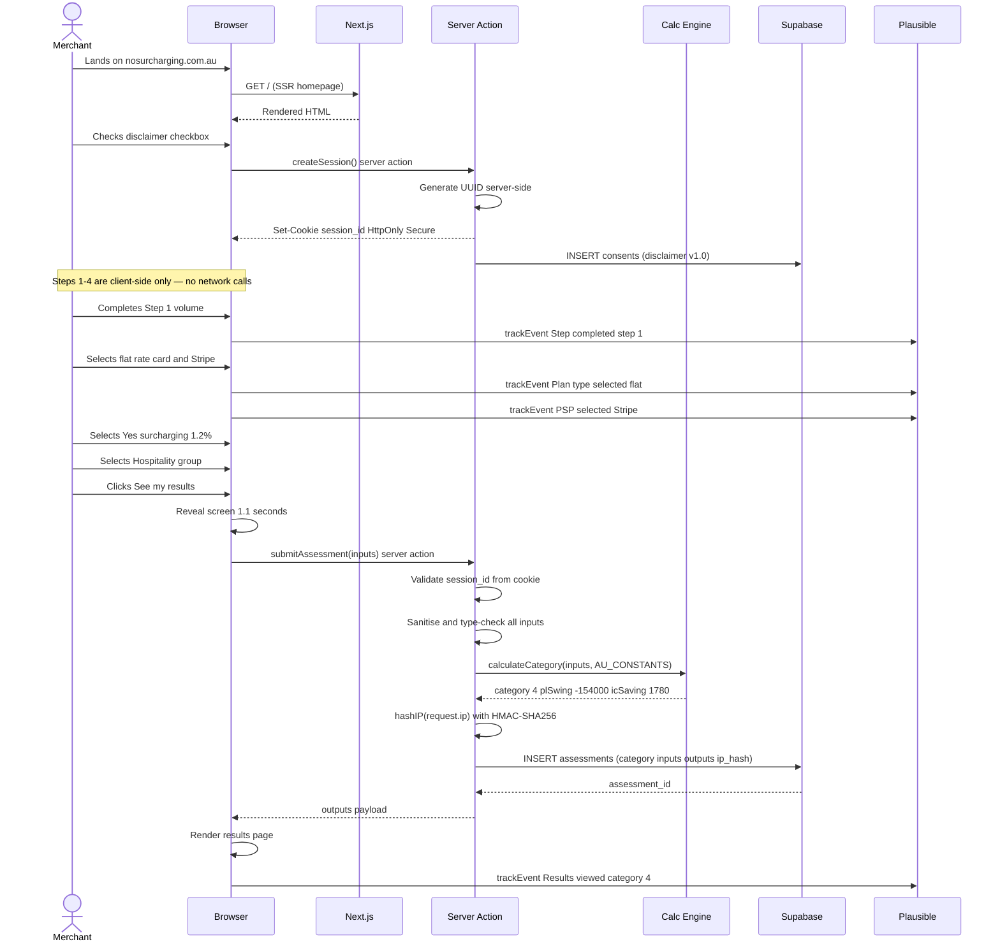
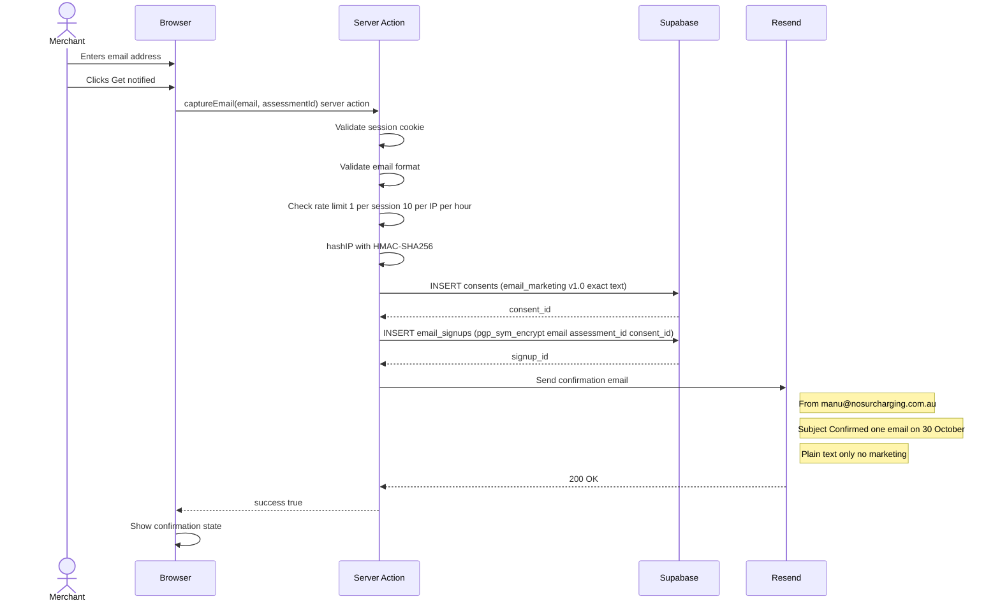
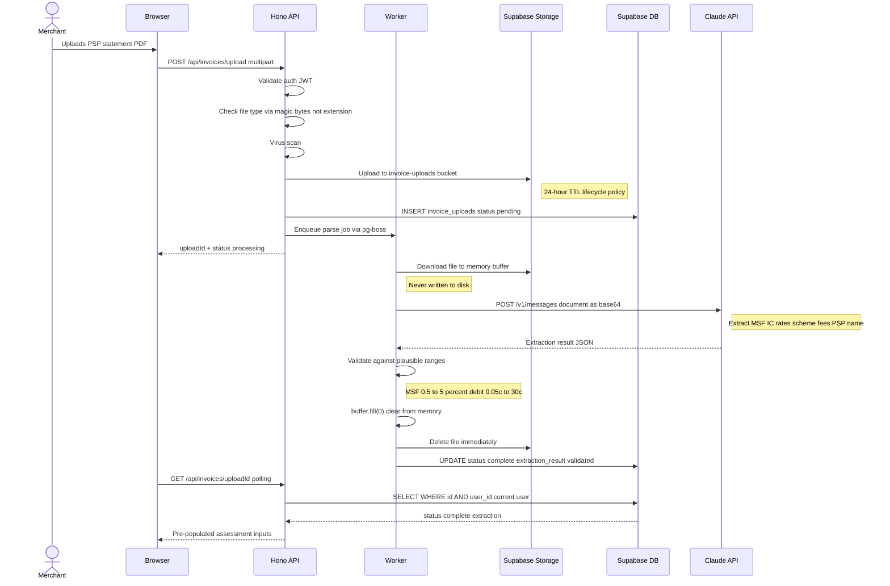
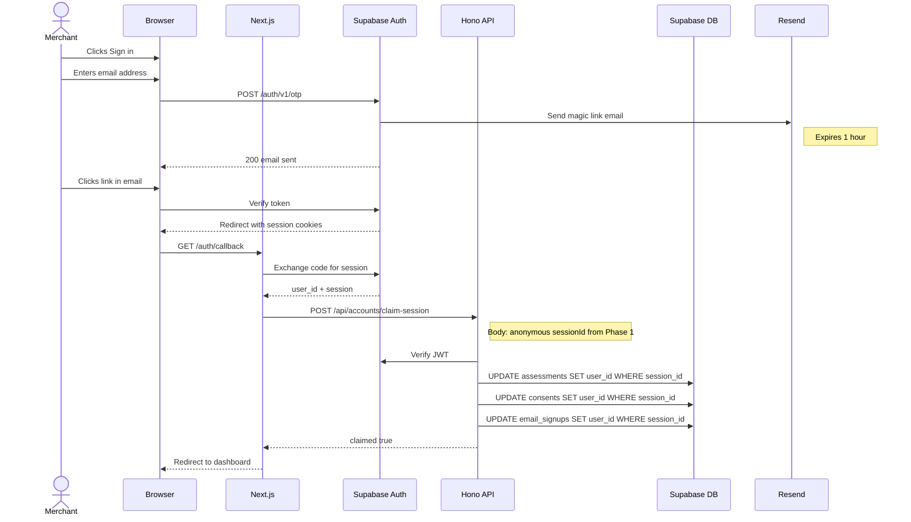
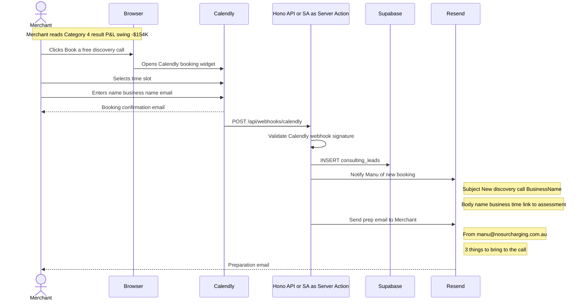
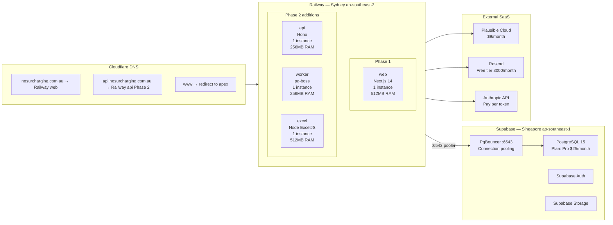
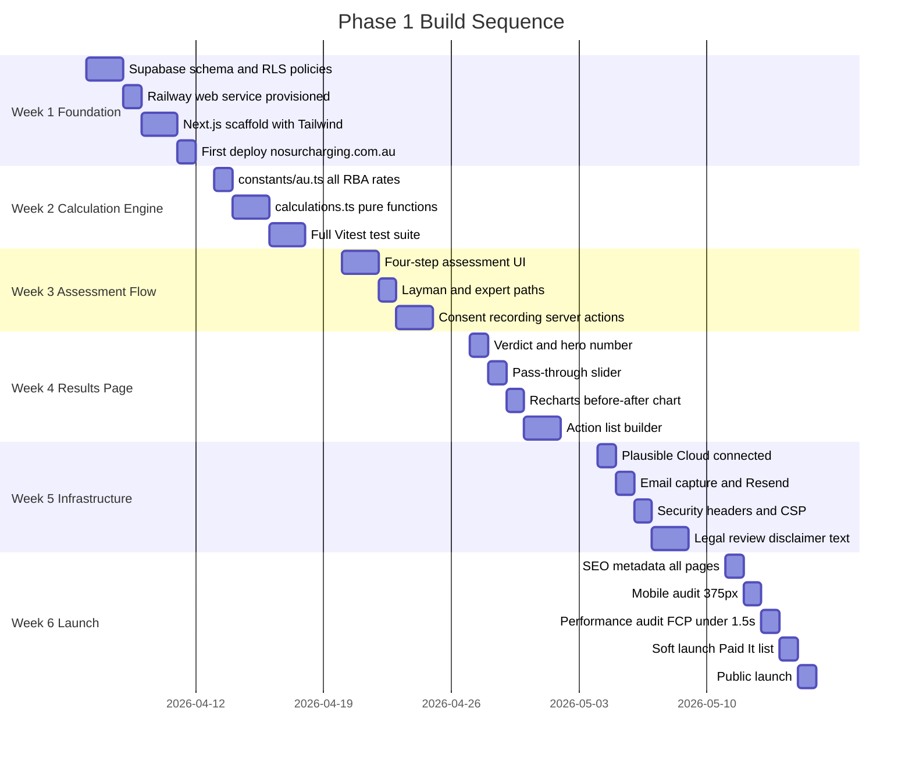

# Solution Architecture
## nosurcharging.com.au — Merchant Payments Intelligence Platform

**Version:** 1.0  
**Date:** April 2026  
**Author:** Manu  
**Status:** Approved — pre-build  

---

## 1. Document Purpose

This document defines the complete solution architecture for nosurcharging.com.au across all three product phases. It captures architectural decisions, the rationale behind each decision, security design, data design, and deployment topology. It serves as the technical reference for the Claude Code build session and for future engineers joining the project.

All decisions in this document reflect lessons from a deliberate critique of an earlier architecture proposal. Where the current approach differs from the initial proposal, the rationale for the change is documented.

---

## 2. Architecture Principles

These principles govern every technical decision in the platform. When a decision is ambiguous, return to these principles.

**Principle 1 — Simplicity over sophistication for Phase 1**
A solo founder building to a hard October 2026 deadline cannot afford to operate complex infrastructure. Every service that does not exist cannot go down, cannot be misconfigured, and cannot consume engineering time. The minimum viable architecture that meets the functional and security requirements is always preferred.

**Principle 2 — Global by design from day one**
Australia is the launch market, not the destination. Every schema table includes `country_code`. Every rate constant lives in a country-namespaced module. Every analytics event includes a `country` property. Expanding to the UK or NZ must be a configuration exercise, not a rebuild.

**Principle 3 — Security is structural, not layered on**
Security controls are enforced at the infrastructure and database level, not just at the application level. Row Level Security enforces consent append-only at the database — not just in the API. Session IDs are generated server-side — not just validated server-side. IP addresses are hashed before they touch any log.

**Principle 4 — The calculation engine is the product**
The calculation engine is the highest-risk component. A wrong number in a financial tool damages trust permanently. The engine is implemented as pure, stateless functions with a complete test suite. No UI code is written until the test suite passes.

**Principle 5 — Independent and trustworthy**
The platform has no commercial relationship with any PSP, acquirer, or card scheme. This principle must be visible in the architecture: no affiliate tracking, no PSP SDK integrations, no data sharing with payment providers. Plausible Analytics is used because it is cookieless and data is not shared with third parties.

**Principle 6 — Phase evolution without rewrites**
Phase 1 stubs exist for Phase 2 features. The database schema includes columns that are nullable in Phase 1 and populated in Phase 2. The API route for Excel generation returns 501 in Phase 1. When Phase 2 is built, it extends the existing foundation rather than replacing it.

---

## 3. System Overview

### 3.1 High-level architecture



### 3.2 Phase 1 vs Phase 2 service count

| Phase | Railway services | External SaaS | Total moving parts |
|---|---|---|---|
| Phase 1 (now) | 1 (Next.js) | 4 (Supabase, Plausible Cloud, Resend, Cloudflare) | 5 |
| Phase 2 (Q1 2027) | 4 (Next.js + Hono + Worker + Excel) | 5 (+ Anthropic API) | 9 |
| Phase 3 (2027+) | 4 + integrations | 5 + ERP connectors | 9+ |

The Phase 1 architecture deliberately has one Railway service. This is the most significant change from the original architecture proposal, which had three Railway services from day one (web, api, plausible). The rationale for consolidation is in section 6.

---

## 4. Phase 1 Architecture — Detailed

### 4.1 Service: web (Next.js 14)

The single Railway service for Phase 1. It handles everything — server-side rendering, the assessment flow, server actions for database writes, and email triggering.

**Why Next.js 14 App Router (not Pages Router):**
The App Router enables React Server Components, which render on the server and ship zero JavaScript for static content. The homepage, SEO content articles, and disclaimer pages are all server-rendered. Only the assessment flow (Steps 1–4) and results page are client components that ship JavaScript. This split is critical for the content strategy: Google indexes the server-rendered pages; the interactive tool loads progressively on top.

**Why not a separate API service in Phase 1:**
The original architecture proposed a separate Hono API service from day one. This was rejected because Phase 1 requires three database operations: consent recording, assessment storage, and email signup. These are simple server actions in Next.js that connect to Supabase using the service-role client. Running a separate API service for three database writes adds operational complexity, inter-service latency, a second CORS configuration, a second set of environment variables, and a second Railway service to monitor — for no functional benefit at Phase 1 scale. The Hono API is added in Phase 2 when the invoice parsing and job queue functionality genuinely justifies a dedicated service.

**Why not a monolithic Express or Fastify server:**
Next.js gives server-side rendering, API routes, image optimisation, and static generation in one framework. The alternative (a separate React SPA + a Node API) requires two build pipelines, two Railway services, and manual CORS configuration. For a solo founder, the framework doing more is better.

**Directory structure:**

```
apps/web/
├── app/
│   ├── page.tsx                    # Homepage (SSR)
│   ├── assessment/
│   │   └── page.tsx                # Assessment flow (client component)
│   ├── results/
│   │   └── page.tsx                # Results page
│   ├── insights/                   # SEO content articles (SSR)
│   ├── privacy/page.tsx            # Privacy policy (SSR)
│   └── layout.tsx                  # Root layout with Plausible script
├── actions/
│   ├── createSession.ts            # Server action: POST /api/sessions
│   ├── recordConsent.ts            # Server action: INSERT consents
│   ├── submitAssessment.ts         # Server action: INSERT assessments
│   └── captureEmail.ts             # Server action: INSERT email_signups
├── lib/
│   ├── supabase/
│   │   ├── server.ts               # Service-role client (server only)
│   │   └── client.ts               # Anon-key client (browser only)
│   ├── analytics.ts                # Plausible trackEvent() helper
│   └── security.ts                 # IP hashing, input sanitisation
└── components/
    ├── assessment/                  # Step components
    ├── results/                     # Results page components
    └── charts/                      # Recharts wrappers
```

**Critical rule for Supabase clients:**
The service-role key must only ever be imported from files in `lib/supabase/server.ts`. An ESLint rule enforces this. The browser client uses the anon key — RLS enforces all access control at the database level.

### 4.2 Calculation engine (shared package)

The calculation engine is a shared TypeScript package, not part of the web application. It is imported by the web app for both server-side assessment storage and client-side slider recalculation.

```
packages/calculations/
├── constants/
│   ├── index.ts        # Country router: getConstants(countryCode)
│   ├── au.ts           # Australia — all RBA rates and reform dates
│   ├── uk.ts           # United Kingdom (Phase 2 stub)
│   └── eu.ts           # European Union (Phase 2 stub)
├── calculations.ts     # Pure functions: calculateMetrics(inputs, constants)
├── categories.ts       # Category assignment: getCategory(planType, surcharging)
├── actions.ts          # Action list builder: buildActions(category, inputs)
└── calculations.test.ts # Full Vitest test suite — must pass before any UI
```

**Why pure functions:**
The calculation engine has no side effects, no database calls, and no API calls. It takes inputs and constants, returns outputs. This makes it trivially testable, importable on both server and client, and safe to run in the browser for real-time slider updates without a network round-trip.

**Why country-namespaced constants:**
`packages/calculations/constants/au.ts` contains every RBA rate, reform date, and scheme fee. The UK and EU files are stubs with documented structure but no values. When the UK expansion begins, the UK constants file is populated and the country router routes UK assessments to it. No other code changes.

**Australian constants (au.ts) — verified against RBA Conclusions Paper March 2026:**

```typescript
export const AU_REFORM_DATES = {
  surchargebBan: '2026-10-01',
  domesticICCuts: '2026-10-01',
  foreignCardCap: '2027-04-01',
  msfPublication: '2026-10-30',
  passThroughReport: '2027-01-30',
} as const;

export const AU_INTERCHANGE = {
  current: {
    debitCentsPerTxn: 0.09,
    consumerCreditPct: 0.0052,
    commercialCreditPct: 0.008,
    foreignPct: 0.028,
  },
  oct2026: {
    debitCentsPerTxn: 0.08,
    consumerCreditPct: 0.003,
    commercialCreditPct: 0.008,  // unchanged
    foreignPct: 0.028,           // unchanged until Apr 2027
  },
  apr2027: {
    foreignPct: 0.01,            // interchange cap only — scheme fees still apply
  },
} as const;

export const AU_SCHEME_FEES = {
  domesticPct: 0.00105,   // 10.5bps — unregulated
  crossBorderPct: 0.0158, // 158bps — unregulated
  // Note: foreign true cost floor = 1.0% IC cap + 1.58% scheme = 2.58%
} as const;

export const AU_CARD_MIX_DEFAULTS = {
  // Source: RBA Statistical Tables C1 (Credit and Charge Cards) and C2 (Debit Cards)
  // URL: https://www.rba.gov.au/statistics/tables/#payments-system
  debitShare: 0.60,
  consumerCreditShare: 0.35,
  foreignShare: 0.05,
  commercialShare: 0.00,
  avgTransactionValue: 65,
} as const;
```

### 4.3 Analytics (PostHog Cloud)

PostHog Cloud is used. The previous decision was Plausible Cloud — it was migrated out in April 2026 because PostHog gives us funnels, identified users (via hashed-email merge), and feature flags in a single tool. No Railway service, no separate Postgres database, no subdomain.

**Why PostHog over GA4:**
GA4 requires a cookie consent banner and is built around advertising attribution. PostHog runs without cookies for unidentified users when configured with `persistence: 'localStorage+cookie'` and no `autocapture`. We do not enable a consent banner at launch; the explicit `Analytics.*` calls only send merchant-classification data, never raw email or financial inputs.

**Why PostHog over Plausible (the original decision):**
Plausible was chosen for cookielessness and simplicity. It does not natively support funnels with branching, identified users, or conditional feature exposure. The migration to PostHog enables the conversion funnel from `homepage_viewed` → `step_completed` → `results_viewed` → `cta_clicked`/`email_captured` to be visualised directly, and lets the same merchant be recognised across sessions via SHA-256(email) identity.

**Why PostHog Cloud over self-hosted:**
Self-hosting adds at least three new Railway services (PostHog web, ClickHouse, plugin server), a Postgres database, and ongoing maintenance. PostHog Cloud's free tier is sufficient for Phase 1 launch volume; the switch to self-hosted (if ever warranted) is a config change.

**Privacy posture at launch:**
- `autocapture: false` — only explicit `Analytics.*` calls send events.
- Session recording: not configured. No DOM snapshots, no rendered text capture.
- `persistence: 'localStorage+cookie'` — required for funnel continuity across page loads.
- Identity: SHA-256 hash of email, never raw. Both client (`identifyUser`) and server (Calendly webhook `consulting_booked`) use the same hash so the merchant maps to one PostHog user across surfaces.

**Provider initialisation in lib/analytics.ts:**

```typescript
posthog.init(process.env.NEXT_PUBLIC_POSTHOG_KEY!, {
  api_host: process.env.NEXT_PUBLIC_POSTHOG_HOST ?? 'https://app.posthog.com',
  capture_pageview: false,         // App Router — manual via PostHogProvider
  autocapture: false,
  persistence: 'localStorage+cookie',
});
```

**Two surfaces:**
- `Analytics.*` — typed API for new events (snake_case names, defined props).
- `trackEvent(name, props)` — legacy wrapper for first-interaction events that don't fit funnel boundaries (Expert mode activated, Card mix entered). Auto-converts the name to snake_case.

Server-side events (Calendly webhook → `consulting_booked`) use `posthog-node` via `lib/posthog-node.ts`.

**Funnel events instrumented (all with `country: 'AU'`):**

| Event | Trigger | Key properties |
|---|---|---|
| `homepage_viewed` | Homepage mount | `referrer`, `utm_*`, `is_mobile` |
| `cta_clicked_homepage` | Any homepage CTA | `cta_location: 'nav'\|'hero'\|'bottom'` |
| `assessment_started` | Disclaimer accepted | — |
| `step_completed` | Step advance | `step`, plus step-specific (`plan_type`, `psp`, `surcharging`, `industry`, `volume_tier`, ...) |
| `zero_cost_rate_selected` | Zero-cost mode pick | `mode` |
| `blended_rates_entered` | Blended rate fields touched | `debit_provided`, `credit_provided` |
| `strategic_rate_exit_viewed` | Strategic-rate exit shown | `trigger: 'self_select'\|'result_page'` |
| `assessment_abandoned` | beforeunload mid-flow | `at_step`, `time_spent_seconds` |
| `assessment_submission_complete` | Reveal screen success | `category` |
| `results_viewed` | Results page first paint | `category`, `pl_swing`, `pl_swing_bucket`, `volume_tier`, `psp`, `plan_type`, `industry`, `surcharging`, `accuracy_pct`, `is_mobile` |
| `section_visited` | Scroll-spy enters section | `section`, `category`, `time_since_results_viewed_seconds` |
| `slider_used` | Pass-through slider moved | `category`, `pass_through_pct` |
| `assumptions_opened` | Assumptions panel expanded | `category` |
| `result_looks_off_clicked` | Top-bar feedback link | `category`, `accuracy_pct` |
| `feedback_opened` / `feedback_submitted` | Feedback modal | `category`, `rating?` |
| `registry_form_started` / `registry_contributed` | PSP rate registry | `psp`, `plan_type`, `volume_tier`, `industry` |
| `email_captured` | Email capture form success | `capture_moment`, `category`, `pl_swing`, `volume_tier`, `psp` |
| `cta_clicked` | Consulting CTA clicked | `cta_type`, `cta_location`, `category`, `pl_swing?`, `volume_tier?`, `psp?` |
| `consulting_booked` (server) | Calendly webhook invitee.created | `source: 'calendly'`, `has_intake_answers`, `event_time` |

---

## 5. Phase 2 Architecture — Additions

Phase 2 adds four new capabilities: invoice intelligence, Excel export, authenticated accounts, and a first international market. The Phase 1 foundation is extended, not replaced.

### 5.1 New service: api (Hono)

The Hono API service is added in Phase 2 because Phase 2 introduces functionality that genuinely warrants a dedicated service: invoice file uploads (multipart handling, virus scanning, async processing), job queue management, Excel generation proxying, and auth middleware.

Next.js server actions have a 10MB request body limit and are not designed for streaming file uploads or long-running jobs. The Hono API has no such constraints.

**Why Hono over Express or Fastify:**
Hono is TypeScript-first (no `@types/` packages needed), runs on multiple runtimes (Node, Bun, Deno, Cloudflare Workers), has a clean middleware API, and is significantly faster than Express. It is the right choice for a greenfield TypeScript API in 2026.

**Why not tRPC:**
tRPC is excellent for type-safe API calls between a Next.js frontend and a Node backend when both are in the same monorepo. For nosurcharging.com.au, the API also needs to serve webhooks (Calendly) and file upload streams — tRPC is not designed for these. Hono handles the full surface area.

### 5.2 New service: worker (pg-boss)

Invoice parsing via the Anthropic API takes 5-30 seconds depending on document complexity. This cannot block an HTTP request. The worker service runs pg-boss jobs that dequeue invoice parsing tasks, call the Anthropic API, validate the extraction result, and update the database.

**Why pg-boss over BullMQ + Redis:**
pg-boss uses the existing Postgres database as its job store. No Redis service is needed. At Phase 2 volumes (hundreds of invoice parses per day, not thousands per second), pg-boss is more than adequate. BullMQ is faster but requires Redis, which adds a sixth service and another billing relationship. pg-boss keeps the service count lower.

### 5.3 New service: excel (Node.js ExcelJS)

**Why ExcelJS not Python/openpyxl:**
The original architecture proposed a Python service using openpyxl. After review, ExcelJS (a Node.js library) is the preferred choice because it eliminates the Python runtime, keeps the stack in a single language (TypeScript), and produces workbooks of sufficient quality for CFO-level use. If ExcelJS cannot produce the required formatting quality during Phase 2 build, the fallback is Python/openpyxl as a separate Flask service — this decision is deferred until the workbook quality can be evaluated against actual requirements.

### 5.4 Authentication (Supabase Auth)

Phase 2 adds magic link authentication and Google OAuth via Supabase Auth. Anonymous Phase 1 assessments are claimed by the new account on first login by matching the session ID cookie.

**Why magic link over password:**
Merchants are not technical users. Password-based auth creates support overhead (forgot password flows, password strength enforcement). Magic link authentication is frictionless — email address only, one click, session established. Google OAuth is added as a secondary option for merchants who prefer it.

---

## 6. Key Architecture Decisions

### Decision 1: Single Railway service in Phase 1

**What:** Use Next.js Server Actions for all database operations in Phase 1. No separate Hono API service.

**Why:** Three database writes (consent, assessment, email signup) do not justify the operational overhead of a separate service. Server actions run on the server, have access to the service-role key via environment variables, and cannot be accessed from the browser. They are functionally equivalent to API endpoints for this use case.

**Trade-off:** When Phase 2 adds the Hono API, server actions need to be migrated to API routes. This migration is straightforward and well-documented. The cost of running a simpler Phase 1 is a two-day migration at Phase 2 start.

**Rejected alternative:** Separate Hono API from day one. Rejected because it adds operational complexity for no Phase 1 functional benefit.

---

### Decision 2: PostHog Cloud not self-hosted

**What:** Use PostHog Cloud rather than a self-hosted Railway service. Migrated from Plausible Cloud in April 2026 — see §4.3 for full rationale.

**Why:** Self-hosting PostHog requires a web service, ClickHouse, plugin server, and a Postgres database. That is at least 3-4 Railway services and ongoing maintenance. PostHog Cloud's free tier covers Phase 1 launch volume. The migration to self-hosted (if ever warranted by data residency or cost at scale) is config-only.

**Trade-off:** PostHog Cloud holds the analytics data. To minimise the privacy footprint we ship with `autocapture: false` and no session recording — only the explicit `Analytics.*` calls reach PostHog, and identity uses a SHA-256 hash of email rather than the raw value.

**Rejected alternative:** Google Analytics 4. Rejected because it requires a cookie consent banner, which creates friction and is inconsistent with the independent, trust-first brand.

---

### Decision 3: ExcelJS over Python/openpyxl

**What:** Use ExcelJS (Node.js) for Excel generation rather than a Python service with openpyxl.

**Why:** Keeps the stack in a single language. Eliminates a separate Railway service. Eliminates Python dependency management. ExcelJS can produce styled workbooks with formulas, multiple sheets, and colour-coded cells.

**Trade-off:** openpyxl produces marginally richer workbook styling. If the CFO-level quality bar cannot be met with ExcelJS, fall back to Python. This decision is validated during Phase 2 build before committing to the implementation.

**Rejected alternative:** SheetJS (client-side). Rejected because client-side generation cannot produce the formula-driven, styled workbooks required. All workbook generation is server-side.

---

### Decision 4: Supabase over raw PostgreSQL on Railway

**What:** Use Supabase rather than a Railway Postgres add-on with a custom auth solution.

**Why:** Supabase provides: PostgreSQL with RLS, magic link authentication (Phase 2), file storage with lifecycle policies (Phase 2), PgBouncer connection pooling, and a management UI — in one platform. Building equivalent functionality with raw Postgres, a custom auth service, and S3-compatible storage would take weeks.

**Trade-off:** Vendor dependency on Supabase. Supabase is open-source and self-hostable — vendor lock-in risk is low. Connection pooling must use port 6543 (PgBouncer), not port 5432 (direct). This is explicitly documented in CLAUDE.md.

**Critical note on region:** The Supabase project must be created in ap-southeast-1 (Singapore) — the closest available region to Railway's Sydney deployment. Cross-region database calls add 50-100ms per query. This cannot be changed after project creation without a full data migration.

---

### Decision 5: Monorepo with Turborepo

**What:** Monorepo structure with Turborepo for build orchestration.

**Why:** The `packages/calculations` shared package is imported by both the web app and (in Phase 2) the API service. A monorepo makes this dependency explicit and manageable. Turborepo provides build caching (the calculation test suite only re-runs when calculation files change), parallel task execution, and automatic dependency graph inference.

**Repository structure:**

```
nosurcharging/
├── CLAUDE.md                    # Claude Code master context
├── turbo.json                   # Turborepo pipeline config
├── package.json                 # Workspace root
├── apps/
│   ├── web/                     # Next.js 14
│   └── api/                     # Hono (Phase 2)
└── packages/
    ├── calculations/            # Shared calculation engine
    │   ├── constants/
    │   │   ├── index.ts
    │   │   ├── au.ts
    │   │   ├── uk.ts            # Phase 2 stub
    │   │   └── eu.ts            # Phase 2 stub
    │   ├── calculations.ts
    │   ├── categories.ts
    │   ├── actions.ts
    │   └── calculations.test.ts
    ├── db/                      # Shared Supabase types + migrations
    │   ├── migrations/
    │   │   └── 001_initial.sql
    │   └── types.ts             # Generated from Supabase schema
    └── ui/                      # Shared UI components (Phase 2)
```

---

## 7. Data Architecture

### 7.1 Schema design principles

Every table includes three columns that are nullable in Phase 1 but populated in later phases:
- `organisation_id` — populated in Phase 3 when enterprise multi-tenancy is added
- `user_id` — populated in Phase 2 when Supabase Auth is added
- `country_code` — populated from day one (defaults to 'AU')

This is deliberate forward-engineering. Retrofitting these columns to a production database with millions of rows is expensive. Adding them as nullable from day one costs nothing.

The `consents` table is append-only. Row Level Security at the database level denies all UPDATE and DELETE operations. This is not enforced at the application level — application-level enforcement is bypassable. Database-level enforcement is not.

### 7.2 Entity relationship diagram



### 7.3 Row Level Security policies

RLS is enabled on all tables from initial migration. Policies are written before application code.

```sql
-- Assessments: session-scoped insert, no public read
ALTER TABLE assessments ENABLE ROW LEVEL SECURITY;

CREATE POLICY "insert own assessment" ON assessments
  FOR INSERT
  WITH CHECK (session_id = current_setting('app.session_id')::uuid);

CREATE POLICY "no public read" ON assessments
  FOR SELECT USING (false);

-- Consents: insert only, UPDATE and DELETE explicitly denied
ALTER TABLE consents ENABLE ROW LEVEL SECURITY;

CREATE POLICY "insert consent" ON consents
  FOR INSERT
  WITH CHECK (session_id = current_setting('app.session_id')::uuid);

CREATE POLICY "deny consent update" ON consents
  FOR UPDATE USING (false);

CREATE POLICY "deny consent delete" ON consents
  FOR DELETE USING (false);

-- Email signups: insert only
ALTER TABLE email_signups ENABLE ROW LEVEL SECURITY;

CREATE POLICY "insert email signup" ON email_signups
  FOR INSERT
  WITH CHECK (true);

CREATE POLICY "no public email read" ON email_signups
  FOR SELECT USING (false);
```

---

## 8. Security Architecture

### 8.1 Security model overview



### 8.2 Security headers configuration

```typescript
// next.config.ts
const securityHeaders = [
  {
    key: 'Strict-Transport-Security',
    value: 'max-age=63072000; includeSubDomains; preload'
  },
  { key: 'X-Frame-Options', value: 'DENY' },
  { key: 'X-Content-Type-Options', value: 'nosniff' },
  { key: 'Referrer-Policy', value: 'strict-origin-when-cross-origin' },
  { key: 'Permissions-Policy', value: 'camera=(), microphone=(), geolocation=()' },
  {
    key: 'Content-Security-Policy',
    value: [
      "default-src 'self'",
      "script-src 'self' 'unsafe-inline' https://plausible.io",
      "style-src 'self' 'unsafe-inline'",
      "img-src 'self' data:",
      "connect-src 'self' https://[project].supabase.co https://plausible.io",
      "frame-ancestors 'none'",
    ].join('; ')
  }
];
```

### 8.3 IP hashing

```typescript
// lib/security.ts
import { createHmac } from 'crypto';

export function hashIP(ip: string): string {
  // IP_HASH_SECRET must be in Railway environment variables
  // Never hash without salt — SHA256(ip) is reversible via rainbow table
  return createHmac('sha256', process.env.IP_HASH_SECRET!)
    .update(ip)
    .digest('hex');
}
```

### 8.4 Secrets inventory

| Secret | Location | Never in | Rotation |
|---|---|---|---|
| `SUPABASE_SERVICE_ROLE_KEY` | Railway API env | Browser, git, logs | 180 days |
| `NEXT_PUBLIC_SUPABASE_ANON_KEY` | Railway web env | Git (use env) | 180 days |
| `IP_HASH_SECRET` | Railway web + api env | Anywhere else | 365 days |
| `RESEND_API_KEY` | Railway web env | Browser, git | 90 days |
| `INTERNAL_API_KEY` | Railway web + api env | Browser | 90 days |
| `ANTHROPIC_API_KEY` | Railway api + worker env | Browser, web | 90 days |

---

## 9. Sequence Diagrams

### 9.1 Assessment submission flow



### 9.2 Email capture flow



### 9.3 Phase 2 invoice parsing flow



### 9.4 Phase 2 authentication flow



### 9.5 Consulting lead conversion flow



---

## 10. Deployment and Infrastructure

### 10.1 Deployment topology



### 10.2 Environment variables (complete list)

**web service (Railway):**

```bash
# Supabase — anon key only in frontend-accessible env
NEXT_PUBLIC_SUPABASE_URL=https://[project].supabase.co
NEXT_PUBLIC_SUPABASE_ANON_KEY=[anon key]

# Supabase — service role for server actions (no NEXT_PUBLIC_ prefix)
SUPABASE_SERVICE_ROLE_KEY=[service role key]

# Database — pooler URL (port 6543 not 5432)
DATABASE_URL=postgresql://postgres:[password]@[project].supabase.co:6543/postgres

# Security
IP_HASH_SECRET=[random 64-char hex]

# Analytics — PostHog (same key value for both — NEXT_PUBLIC_ exposes to browser)
NEXT_PUBLIC_POSTHOG_KEY=phc_...
NEXT_PUBLIC_POSTHOG_HOST=https://app.posthog.com
POSTHOG_NODE_KEY=phc_...

# Email
RESEND_API_KEY=[resend key]
RESEND_FROM=manu@nosurcharging.com.au

# Internal service auth (Phase 2)
INTERNAL_API_KEY=[random 64-char hex]
```

**api service (Railway — Phase 2):**

```bash
SUPABASE_URL=https://[project].supabase.co
SUPABASE_SERVICE_ROLE_KEY=[service role key]
DATABASE_URL=postgresql://postgres:[password]@[project].supabase.co:6543/postgres
IP_HASH_SECRET=[same as web]
ANTHROPIC_API_KEY=[anthropic key]
RESEND_API_KEY=[resend key]
CORS_ORIGINS=https://nosurcharging.com.au
INTERNAL_API_KEY=[same as web]
CALENDLY_WEBHOOK_SECRET=[calendly signing key]
```

### 10.3 Build sequence (six weeks)



---

## 11. Error Handling and Observability

### 11.1 Error tracking (Sentry)

Sentry is added to both the Next.js app before launch. The free tier covers 5,000 errors per month — sufficient for Phase 1.

```typescript
// sentry.client.config.ts
import * as Sentry from '@sentry/nextjs';

Sentry.init({
  dsn: process.env.NEXT_PUBLIC_SENTRY_DSN,
  environment: process.env.NODE_ENV,
  // Never capture personally identifiable information
  beforeSend(event) {
    // Strip email addresses from error context
    if (event.request?.data) {
      delete event.request.data.email;
    }
    return event;
  },
});
```

**Critical:** Sentry must be configured to scrub PII before any event is sent. Email addresses, IP addresses, and assessment inputs must not appear in Sentry error context.

### 11.2 Structured logging

Railway's built-in log drain sends all console output to the Railway log viewer. Structured JSON logs are used throughout:

```typescript
// lib/logger.ts
export function log(level: 'info' | 'warn' | 'error', event: string, meta?: object) {
  console.log(JSON.stringify({
    level,
    event,
    timestamp: new Date().toISOString(),
    ...meta,
    // Never log raw IP, email, or assessment inputs
  }));
}
```

### 11.3 Health check endpoint

```typescript
// app/api/health/route.ts
export async function GET() {
  return Response.json({
    status: 'ok',
    version: process.env.npm_package_version,
    timestamp: new Date().toISOString(),
  });
}
```

Railway uses this endpoint for health monitoring. If the health check fails, Railway automatically restarts the service.

---

## 12. Open Architecture Questions

| ID | Question | Impact | Decision needed by |
|---|---|---|---|
| OA-01 | ExcelJS vs Python openpyxl quality — evaluate during Phase 2 build | Phase 2 service count | Phase 2 start |
| OA-02 | Supabase region — confirm ap-southeast-1 available and selected | Latency for all DB calls | Before project creation |
| OA-03 | Rate limit store — confirm Supabase table approach sufficient for Phase 1 volume | Rate limit accuracy | Week 1 |
| OA-04 | pg-boss vs BullMQ + Redis — confirm pg-boss adequate for Phase 2 invoice volumes | Phase 2 worker reliability | Phase 2 start |
| OA-05 | Global brand domain — resolve before Phase 2 international launch | Phase 2 deployment complexity | Before Phase 2 |
| OA-06 | PSP Rate Registry — Phase 1 or Phase 2 feature | Adds trust_score logic and quarantine flow | Week 4 decision |

---

## 13. What to tell Claude Code

The following block should be appended to CLAUDE.md before the architecture session:

```markdown
## Solution architecture decisions (read this section first)

### Phase 1 service count: ONE Railway service
Only the web (Next.js) service exists in Phase 1.
All database operations use Next.js Server Actions.
DO NOT create a separate Hono API service in Phase 1.
DO NOT self-host Plausible — use Plausible Cloud.

### Database connections: pooler only
ALL Supabase connections must use the PgBouncer pooler URL.
Port 6543, NOT port 5432.
Store as DATABASE_URL with the pooler connection string.

### Supabase client separation (critical)
lib/supabase/server.ts — imports service role key, server only
lib/supabase/client.ts — imports anon key, browser safe
ESLint rule: supabaseAdmin must only be imported from *.server.ts files

### Plausible Cloud
Script tag in app/layout.tsx:
  data-domain from NEXT_PUBLIC_PLAUSIBLE_DOMAIN env var
  src: https://plausible.io/js/script.tagged-events.js
DO NOT create a Railway Plausible service.

### Calculation engine: tests first
packages/calculations/calculations.test.ts must pass
before ANY UI component is written.
This is a hard gate in the build sequence.

### IP hashing: salted HMAC only
Use lib/security.ts hashIP() function.
Never call SHA256 directly without the IP_HASH_SECRET salt.
Never log or store raw IP addresses.

### RLS policies: written before application code
migrations/001_initial.sql contains all RLS policies.
The consents table has explicit UPDATE and DELETE deny policies.
These are enforced at the database, not the application layer.
```

---

*Solution Architecture v1.0 · nosurcharging.com.au · April 2026*  
*Source for all RBA rate data: RBA Conclusions Paper, 31 March 2026*
